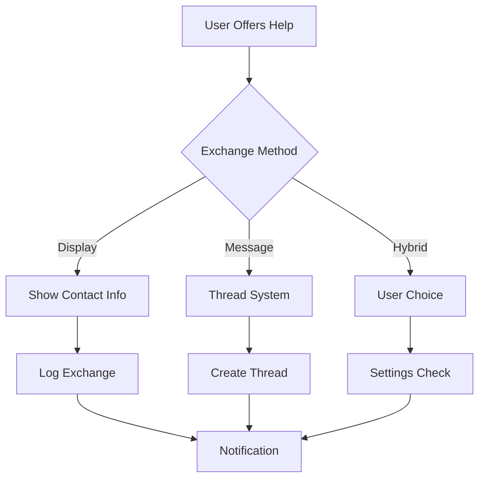

# 🎯 Care Collective v2 Refactoring Plan Using PRP Methodology

### Executive Summary

The Care Collective platform needs to evolve from its current preview state to a production-ready v2 that addresses client feedback and implements scalable architecture. This plan uses the PRP (Product Requirement Prompt) methodology to structure the refactoring process, ensuring one-pass implementation success through comprehensive context engineering.

---

## 📋 Phase 1: PRP Methodology Integration & Project Setup

### 1.1 PRP Infrastructure Setup

**Objective:** Establish PRP methodology as the core planning and implementation framework

**Implementation Steps:**

1. **Copy PRP Resources to Project**
   ```bash
   # From care-collective-preview directory
   cp -r PRPs-agentic-eng/.claude .
   cp -r PRPs-agentic-eng/PRPs .
   mkdir -p PRPs/completed PRPs/active PRPs/backlog
   ```

2. **Create Project-Specific CLAUDE.md**
   - Merge existing CLAUDE.md with Care Collective specifics
   - Define coding standards for Next.js 15, TypeScript, Supabase
   - Set file size limits (max 500 lines)
   - Establish testing requirements

3. **Initialize PRP Templates**
   - Customize templates for Next.js/React patterns
   - Add Supabase-specific context sections
   - Include Tailwind CSS guidelines

### 1.2 Project Context Documentation

**Create AI Documentation Directory:**
```
PRPs/ai_docs/
├── care_collective_architecture.md
├── supabase_patterns.md
├── nextjs15_conventions.md
├── tailwind_design_system.md
├── authentication_flow.md
└── database_schema.md
```

---

## 📝 Phase 2: Core PRPs for Initial Launch

### PRP 1: Typography & Design System Enhancement

**Type:** `prp_base.md`

**Goal:** Implement client feedback on typography and brand colors

**Context Requirements:**
- Current token system in `/app/styles/tokens.css`
- Brand colors: #7A9E99 (sage), #D8A8A0 (dusty rose)
- Readable mode implementation
- Mobile-first responsive scaling

**Implementation Blueprint:**
```yaml
Task 1: UPDATE app/styles/tokens.css
  - Add brand color CSS variables
  - Create typography scale system
  - Implement readable mode variables

Task 2: UPDATE app/globals.css
  - Increase base font sizes
  - Add responsive typography classes
  - Implement brand color utility classes

Task 3: CREATE app/context/ThemeContext.tsx
  - Theme provider with brand colors
  - Typography size controls
  - Persist user preferences

Task 4: UPDATE components/ui/*.tsx
  - Apply new typography scale
  - Integrate brand colors
  - Ensure consistency across components
```

### PRP 2: Contact Exchange System

**Type:** `prp_spec.md` with architecture planning

**High-Level Objective:** Enable secure communication between helpers and requesters

**Mid-Level Objectives:**
1. Build flexible architecture supporting multiple exchange methods
2. Implement privacy controls and audit logging
3. Create intuitive UI for contact sharing
4. Add real-time notifications for exchanges

**Implementation Options:**



**Database Schema:**
```sql
-- Core tables for both approaches
CREATE TABLE contact_exchanges (
  id UUID PRIMARY KEY,
  request_id UUID REFERENCES help_requests(id),
  helper_id UUID REFERENCES profiles(id),
  requester_id UUID REFERENCES profiles(id),
  exchange_type TEXT CHECK (exchange_type IN ('display', 'message', 'both')),
  status TEXT CHECK (status IN ('pending', 'accepted', 'declined')),
  exchanged_at TIMESTAMPTZ,
  metadata JSONB
);

CREATE TABLE exchange_preferences (
  user_id UUID REFERENCES profiles(id),
  default_method TEXT,
  auto_accept BOOLEAN DEFAULT FALSE,
  privacy_level INTEGER
);
```

### PRP 3: Category System Expansion

**Type:** `prp_task.md`

**Task:** Expand categories from 5 to 12+ with optional admin management

**Current State:**
- Hardcoded categories in `/app/requests/new/page.tsx`
- No database storage for categories

**Target State:**
- 12 predefined categories with icons
- Optional database-driven categories
- Admin interface for category management
- Category usage analytics

**Implementation:**
```typescript
// lib/categories.ts
export const CATEGORIES = [
  { id: 'transportation', label: 'Transportation', icon: Car, color: 'blue' },
  { id: 'household', label: 'Household Tasks', icon: Home, color: 'green' },
  { id: 'meals', label: 'Meal Preparation', icon: UtensilsCrossed, color: 'orange' },
  { id: 'respite', label: 'Respite Care', icon: Heart, color: 'pink' },
  { id: 'companionship', label: 'Companionship', icon: Users, color: 'purple' },
  { id: 'childcare', label: 'Childcare', icon: Baby, color: 'yellow' },
  { id: 'petcare', label: 'Pet Care', icon: Dog, color: 'brown' },
  { id: 'technology', label: 'Technology Help', icon: Laptop, color: 'blue' },
  { id: 'emotional', label: 'Emotional Support', icon: HeartHandshake, color: 'rose' },
  { id: 'groceries', label: 'Groceries', icon: ShoppingCart, color: 'green' },
  { id: 'medical', label: 'Medical/Pharmacy', icon: Pill, color: 'red' },
  { id: 'other', label: 'Other', icon: MoreHorizontal, color: 'gray' }
];
```

### PRP 4: Production Readiness

**Type:** `prp_planning.md` with comprehensive validation

**Components:**

1. **Security Hardening**
   - Rate limiting implementation
   - Content Security Policy
   - SQL injection prevention
   - XSS protection
   - CORS configuration

2. **Performance Optimization**
   - Image optimization with Next.js Image
   - Code splitting and lazy loading
   - Database query optimization
   - CDN integration
   - Service worker for caching

3. **Monitoring & Analytics**
   - Error tracking (Sentry)
   - Performance monitoring
   - User analytics (privacy-friendly)
   - Health check endpoints
   - Database monitoring

4. **Testing Suite**
   ```yaml
   Unit Tests:
     - Components with React Testing Library
     - Utility functions with Jest
     - API routes with mock data
   
   Integration Tests:
     - Authentication flows
     - Request creation/management
     - Contact exchange workflows
   
   E2E Tests:
     - Critical user journeys with Cypress
     - Mobile responsiveness
     - Cross-browser compatibility
   ```

---

## 🔄 Phase 3: PRP Execution Strategy

### 3.1 PRP Runner Configuration

**Setup automated PRP execution:**

```python
# PRPs/scripts/care_collective_runner.py
import subprocess
from pathlib import Path

class CareCollectivePRPRunner:
    def __init__(self):
        self.project_root = Path.cwd()
        self.prp_dir = self.project_root / "PRPs"
        
    def validate_environment(self):
        """Ensure Next.js, Supabase, and dependencies are ready"""
        checks = [
            ("Node.js", "node --version"),
            ("npm", "npm --version"),
            ("Supabase CLI", "supabase --version"),
            ("TypeScript", "tsc --version")
        ]
        
    def run_prp(self, prp_name: str, interactive: bool = True):
        """Execute a PRP with validation loops"""
        # Implementation details...
```

### 3.2 Validation Loops

**Each PRP includes 4 validation levels:**

1. **Syntax & Style**
   ```bash
   npm run lint
   npm run type-check
   npx prettier --check .
   ```

2. **Unit Tests**
   ```bash
   npm test -- --coverage
   npm test -- --watch
   ```

3. **Integration Testing**
   ```bash
   npm run dev &
   npm run test:e2e
   ```

4. **Production Validation**
   ```bash
   npm run build
   npm run start
   # Lighthouse CI checks
   # Security scanning
   ```

---

## 📊 Phase 4: Implementation Timeline

### Week 1: Foundation & Setup
- [ ] Day 1-2: PRP infrastructure setup
- [ ] Day 2-3: Typography & design system PRP
- [ ] Day 3-4: Create AI documentation
- [ ] Day 4-5: Initial testing framework

### Week 2: Core Features
- [ ] Day 1-2: Contact exchange PRP (architecture)
- [ ] Day 3-4: Category expansion PRP
- [ ] Day 4-5: Location enhancement PRP

### Week 3: Integration & Testing
- [ ] Day 1-2: Integration testing
- [ ] Day 3-4: Performance optimization
- [ ] Day 4-5: Security hardening

### Week 4: Launch Preparation
- [ ] Day 1-2: Production deployment setup
- [ ] Day 3: Final testing and validation
- [ ] Day 4: Documentation completion
- [ ] Day 5: Launch readiness review

---

## 🎯 Phase 5: Future PRP Pipeline

### Backlog PRPs (Post-Launch)

1. **Real-time Features PRP**
   - WebSocket implementation
   - Live notifications
   - Presence indicators

2. **Advanced Search PRP**
   - Full-text search
   - Filtering system
   - Location-based search

3. **Analytics Dashboard PRP**
   - Admin analytics
   - User insights
   - Community health metrics

4. **Mobile PWA PRP**
   - Service worker
   - Offline support
   - Push notifications

5. **Community Groups PRP**
   - Group creation/management
   - Group-specific requests
   - Moderation tools

---

## 🔧 Technical Implementation Details

### Database Migration Strategy

```sql
-- Migration 001: Contact Exchange
CREATE MIGRATION add_contact_exchange;

-- Migration 002: Extended Categories
CREATE MIGRATION add_category_management;

-- Migration 003: Location Granularity
CREATE MIGRATION add_location_features;

-- Migration 004: User Preferences
CREATE MIGRATION add_user_preferences;
```

### Feature Flag Implementation

```typescript
// lib/features.ts
export const features = {
  contactExchange: {
    enabled: getFeatureFlag('CONTACT_EXCHANGE'),
    type: getFeatureFlag('CONTACT_EXCHANGE_TYPE') as 'display' | 'message' | 'both'
  },
  expandedCategories: getFeatureFlag('EXPANDED_CATEGORIES'),
  advancedLocation: getFeatureFlag('ADVANCED_LOCATION'),
  adminTools: getFeatureFlag('ADMIN_TOOLS')
};
```

### Environment Configuration

```env
# .env.local
NEXT_PUBLIC_SUPABASE_URL=
NEXT_PUBLIC_SUPABASE_ANON_KEY=
SUPABASE_SERVICE_ROLE_KEY=

# Feature Flags
NEXT_PUBLIC_FEATURE_CONTACT_EXCHANGE=true
NEXT_PUBLIC_FEATURE_CONTACT_EXCHANGE_TYPE=both
NEXT_PUBLIC_FEATURE_EXPANDED_CATEGORIES=true
NEXT_PUBLIC_FEATURE_ADVANCED_LOCATION=false

# Brand Configuration
NEXT_PUBLIC_BRAND_COLOR_SAGE=#7A9E99
NEXT_PUBLIC_BRAND_COLOR_ROSE=#D8A8A0
```

---

## 📈 Success Metrics & Monitoring

### Key Performance Indicators

1. **Technical Metrics**
   - Page load time < 2s
   - Lighthouse score > 90
   - Zero critical vulnerabilities
   - 99.9% uptime

2. **User Engagement**
   - Request completion rate > 60%
   - Average response time < 24h
   - User retention (7-day) > 40%
   - Active user growth 10% monthly

3. **Code Quality**
   - Test coverage > 80%
   - All PRPs validated successfully
   - Zero regression bugs
   - Documentation completeness 100%

---

## 🚀 Deployment Strategy

### Environments

1. **Development** - Local development with Supabase CLI
2. **Staging** - Vercel preview deployments
3. **Production** - Vercel production with custom domain

### CI/CD Pipeline

```yaml
# .github/workflows/deploy.yml
name: Deploy
on:
  push:
    branches: [main]
  pull_request:
    branches: [main]

jobs:
  validate:
    runs-on: ubuntu-latest
    steps:
      - uses: actions/checkout@v3
      - name: Run PRP Validation
        run: |
          npm ci
          npm run lint
          npm run type-check
          npm test
          npm run build
```

---

## 📚 Documentation Deliverables

### For Development Team
- PRP execution guides
- Architecture decision records
- API documentation
- Database schema docs

### For Client
- User guide
- Admin documentation
- Deployment guide
- Feature roadmap

### For Community
- Contributing guidelines
- Code of conduct
- Security policy
- Privacy policy

---

## ✅ Implementation Checklist

### Immediate Actions (Week 1)
- [ ] Set up PRP infrastructure
- [ ] Create initial PRPs for client feedback
- [ ] Establish validation pipelines
- [ ] Begin typography/design implementation

### Short-term (Weeks 2-3)
- [ ] Execute core feature PRPs
- [ ] Implement contact exchange system
- [ ] Expand category system
- [ ] Add location features

### Launch Ready (Week 4)
- [ ] Complete all validation loops
- [ ] Deploy to production
- [ ] Monitor initial usage
- [ ] Gather user feedback

### Post-Launch
- [ ] Execute backlog PRPs
- [ ] Iterate based on feedback
- [ ] Scale infrastructure as needed
- [ ] Maintain documentation

---

## 🎯 Conclusion

This PRP-based refactoring plan provides:

1. **Structured Approach**: Clear phases with specific deliverables
2. **Context Engineering**: Comprehensive documentation for AI-assisted development
3. **Validation Built-in**: Multiple checkpoints ensure quality
4. **Flexibility**: Modular PRPs allow priority adjustments
5. **Production Ready**: Focus on security, performance, and scalability

The PRP methodology ensures that each implementation phase has complete context, clear success criteria, and validation loops - enabling efficient, high-quality development that delivers production-ready code on the first pass.

By following this plan, Care Collective v2 will launch as a robust, scalable platform ready to serve the community's mutual aid needs while maintaining flexibility for future enhancements.