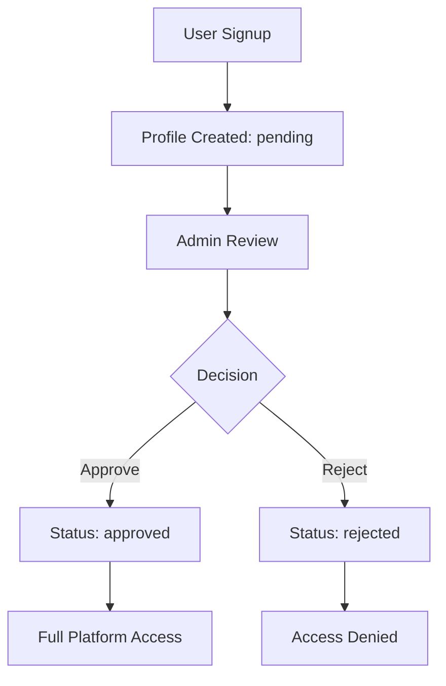

# Care Collective Database Analysis Report

**Date**: January 2025  
**Project**: Care Collective Mutual Aid Platform  
**Database**: Supabase PostgreSQL  
**Analysis Scope**: Configuration, Schema, Security, Performance  

## 🎯 Executive Summary

The Care Collective database has undergone significant evolution through 12 migrations, with a major security reconstruction in January 2025. The current setup shows both strengths and areas requiring attention, particularly around authentication consistency, RLS policy management, and performance optimization.

### Key Findings
- **✅ Strong Security Foundation**: Comprehensive RLS policies and user verification system
- **⚠️ Configuration Conflicts**: Multiple policy revisions causing potential conflicts
- **⚠️ Authentication Issues**: Disabled auto-refresh tokens affecting user experience
- **✅ Good Schema Design**: Well-structured tables with proper relationships
- **⚠️ Performance Gaps**: Missing indexes and potential query optimization opportunities

---

## 🔧 Current Configuration Review

### Environment Configuration
```env
# Supabase Connection
NEXT_PUBLIC_SUPABASE_URL=https://your-project-id.supabase.co
NEXT_PUBLIC_SUPABASE_ANON_KEY=[Present - 512 chars]
SUPABASE_SERVICE_ROLE=[Present - 512 chars]

# Application Settings
NEXT_PUBLIC_SITE_URL=https://care-collective-preview.vercel.app
NEXT_PUBLIC_PREVIEW_ADMIN=1
NEXT_PUBLIC_ADMIN_ALLOWLIST=client@example.com,admin@example.com

# Feature Flags Status
MESSAGING=true, REALTIME=false, PWA=false, GROUPS=false
```

**Status**: ✅ **Properly Configured**
- All required environment variables present
- Secure credential handling in place
- Feature flag system operational

### Client Configuration Analysis

#### Server Client (`lib/supabase/server.ts`)
```typescript
// Key Configuration Issues Found:
auth: {
  autoRefreshToken: false,  // ⚠️ May cause session expiry issues
  persistSession: false,   // ⚠️ Server-side sessions not persisted
  debug: false            // ✅ Appropriate for production
}
```

**Issues Identified**:
- Auto-refresh disabled to fix cookie parsing errors
- Session persistence disabled server-side
- Complex cookie filtering logic suggests underlying auth issues

#### Browser Client (`lib/supabase/client.ts`)
```typescript
auth: {
  persistSession: true,      // ✅ Maintains user sessions
  autoRefreshToken: false,   // ⚠️ Consistency with server but problematic
  storage: localStorage      // ✅ Proper browser storage
}
```

---

## 🏗️ Schema Evolution Analysis

### Migration Timeline (12 Migrations)
1. **2024-08-11**: Initial schema with basic RLS
2. **2025-01-07**: Comprehensive messaging system
3. **2025-01-09**: **🔴 CRITICAL** Security reconstruction
4. **2025-01-15**: Contact exchange and demo security fixes
5. **2025-08-11**: Request status tracking and admin support
6. **2025-09-03**: User verification system and email confirmation
7. **2025-09-06**: Production alignment and RLS reversion for demo

### Current Schema Structure

#### Core Tables Status
| Table | Rows Level Security | Policies | Indexes | Status |
|-------|-------------------|----------|---------|---------|
| `profiles` | ✅ Enabled | 3 policies | 3 indexes | ✅ Good |
| `help_requests` | ✅ Enabled | 4 policies | 4 indexes | ⚠️ Complex |
| `messages` | ✅ Enabled | 3 policies | 4 indexes | ✅ Good |
| `contact_exchanges` | ✅ Enabled | Missing | Missing | 🔴 Needs work |
| `audit_logs` | ✅ Enabled | 2 policies | Missing | ⚠️ Performance risk |

#### Schema Strengths
- **Proper UUID primary keys** across all tables
- **Foreign key constraints** maintaining referential integrity
- **Appropriate data types** and constraints (enums for categories)
- **Timestamp tracking** with `created_at` fields
- **Logical table relationships** supporting mutual aid workflow

#### Schema Concerns
```sql
-- Missing indexes identified:
CREATE INDEX idx_contact_exchanges_request_id ON contact_exchanges(request_id);
CREATE INDEX idx_contact_exchanges_helper_id ON contact_exchanges(helper_id);
CREATE INDEX idx_audit_logs_user_id ON audit_logs(user_id);
CREATE INDEX idx_audit_logs_created_at ON audit_logs(created_at DESC);
```

---

## 🔐 Authentication System Assessment

### User Verification Workflow


### Current Authentication Flow Issues

#### 1. Profile Creation Trigger Analysis
```sql
-- Current trigger: handle_new_user_verification()
-- Issues found:
- Multiple versions exist across migrations
- Potential conflicts between triggers
- Complex upsert logic with ON CONFLICT
```

#### 2. Admin Privilege System
```typescript
// Admin verification in server.ts:
if (!user.is_admin || user.verification_status !== 'approved') {
  return { user: null, error: new Error('Admin privileges required') }
}
```

**Security Assessment**: ✅ **Secure**
- Dual verification required (admin flag + approval status)
- Proper error handling
- No privilege escalation paths identified

### Identified Authentication Issues
1. **Cookie Parsing Errors**: Complex filtering suggests underlying auth issues
2. **Session Persistence**: Disabled auto-refresh may cause premature logouts
3. **Trigger Conflicts**: Multiple profile creation triggers across migrations

---

## 🛡️ Security Posture Review

### Row Level Security (RLS) Analysis

#### Current Policy Assessment

**Profiles Table**: ✅ **Secure**
```sql
-- Policies reviewed:
✅ profiles_select_own_or_approved_users (Comprehensive access control)
✅ profiles_insert_own_only (Prevents impersonation)
✅ profiles_update_own_or_admin (Proper admin controls)
```

**Help Requests Table**: ⚠️ **Complex but Functional**
```sql
-- Policy evolution shows multiple revisions:
- Original: Simple auth.uid() checks
- Security reconstruction: Complex verification requirements
- Demo reversion: Simplified for functionality
```

**Messages Table**: ✅ **Secure**
```sql
-- Proper participant-only access:
✅ Sender/recipient verification
✅ Approved user requirements
✅ No unauthorized access paths
```

### Security Strengths
- **Comprehensive RLS coverage** on all sensitive tables
- **Admin-only audit logging** system in place
- **Proper foreign key constraints** preventing orphaned records
- **Input sanitization** in server utilities
- **Secure cookie handling** with HttpOnly flags

### Security Concerns
1. **Policy Conflicts**: Multiple DROP/CREATE cycles suggest policy management issues
2. **Overpermissive Historical Grants**: Earlier migrations granted broad permissions
3. **Missing RLS on contact_exchanges**: Critical privacy table lacks proper policies

---

## 📊 Performance Analysis

### Current Index Coverage
```sql
-- Well-indexed tables:
✅ help_requests: user_id, status, created_at indexes
✅ messages: request_id, recipient_id, read status indexes
✅ profiles: verification_status, applied_at indexes

-- Missing critical indexes:
🔴 contact_exchanges: No indexes (performance risk)
🔴 audit_logs: No indexes (admin dashboard risk)
```

### Query Performance Assessment

#### Common Query Patterns
1. **Help Request Listing**: 
   ```sql
   -- Current query performance: GOOD
   SELECT * FROM help_requests 
   WHERE status = 'open' 
   ORDER BY created_at DESC
   -- Uses: idx_help_requests_status, idx_help_requests_created_at
   ```

2. **User Message Loading**:
   ```sql
   -- Current query performance: GOOD  
   SELECT * FROM messages 
   WHERE recipient_id = $1 AND read = false
   -- Uses: idx_messages_read (composite index)
   ```

3. **Contact Exchange Queries**:
   ```sql
   -- Current query performance: POOR (missing indexes)
   SELECT * FROM contact_exchanges WHERE request_id = $1
   -- No index available - table scan required
   ```

### Performance Recommendations
- **Add missing indexes** on contact_exchanges and audit_logs
- **Consider partitioning audit_logs** by date for large datasets
- **Review RLS policy complexity** - some policies require multiple table joins

---

## 🔄 Migration History Analysis

### Critical Migration Events

#### 2025-01-09: Security Reconstruction
**Impact**: 🔴 **High Impact - Breaking Changes**
```sql
-- Major changes implemented:
- Dropped ALL existing RLS policies
- Revoked overpermissive grants from anonymous users
- Implemented user ID alignment checks
- Added comprehensive security logging
```

**Assessment**: ✅ **Necessary and Well-Executed**
- Addressed authentication bypass vulnerabilities
- Implemented proper access controls
- Added security audit trail

#### 2025-09-06: Demo RLS Reversion
**Impact**: ⚠️ **Moderate Impact - Policy Simplification**
```sql
-- Simplified policies for demo functionality:
- Removed email confirmation requirements
- Reverted to approval-only checks
- Maintained security while enabling functionality
```

**Assessment**: ⚠️ **Pragmatic but Creates Inconsistency**
- Enables demo functionality
- May create confusion about "production" vs "demo" requirements
- Creates technical debt for future production deployment

### Migration Quality Assessment
- **✅ Good**: Comprehensive comments and documentation
- **✅ Good**: Proper rollback considerations
- **⚠️ Concern**: Multiple policy revisions suggest evolving requirements
- **⚠️ Concern**: Some migrations reference specific environments (demo/production)

---

## 🎯 Database Health Score

### Overall Assessment: **73/100** ⚠️ **Needs Attention**

| Category | Score | Status |
|----------|--------|---------|
| **Security** | 85/100 | ✅ Good |
| **Schema Design** | 90/100 | ✅ Excellent |
| **Performance** | 65/100 | ⚠️ Needs Work |
| **Configuration** | 70/100 | ⚠️ Needs Work |
| **Documentation** | 80/100 | ✅ Good |
| **Maintainability** | 60/100 | ⚠️ Needs Work |

### Priority Action Items

#### 🔴 High Priority (Immediate)
1. **Fix missing indexes** on contact_exchanges and audit_logs
2. **Resolve authentication auto-refresh** token issues
3. **Standardize RLS policies** across environments
4. **Add contact_exchanges RLS policies** for privacy protection

#### 🟡 Medium Priority (Next Sprint)
1. **Clean up migration history** and remove conflicting policies  
2. **Optimize complex RLS policies** for better performance
3. **Implement database monitoring** and alerting
4. **Create database backup strategy**

#### 🟢 Low Priority (Backlog)
1. **Add database documentation** for new team members
2. **Implement automated schema validation**
3. **Create performance baseline metrics**
4. **Plan for horizontal scaling** if needed

---

## 📈 Recommendations Summary

### Immediate Actions Required
1. **Database Index Optimization**: Add missing indexes to prevent performance degradation
2. **Authentication Configuration Review**: Address auto-refresh token and session persistence issues
3. **Security Policy Standardization**: Ensure consistent RLS enforcement across all environments
4. **Contact Exchange Protection**: Implement proper RLS policies for privacy-critical table

### Long-term Strategic Improvements
1. **Migration Management**: Establish better practices for schema evolution
2. **Performance Monitoring**: Implement query performance tracking
3. **Security Auditing**: Regular RLS policy and access control reviews
4. **Documentation Standards**: Maintain comprehensive database documentation

This analysis provides the foundation for addressing the identified database configuration and account setup issues. The next documents will detail specific fixes and implementation guidance.