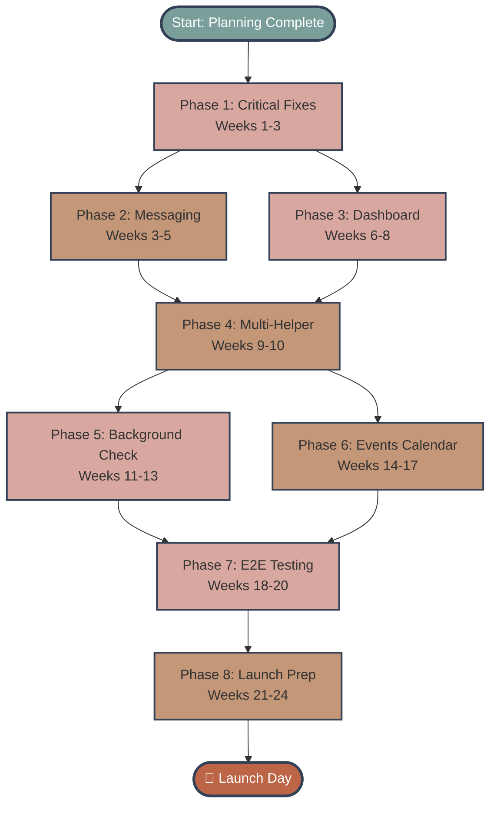
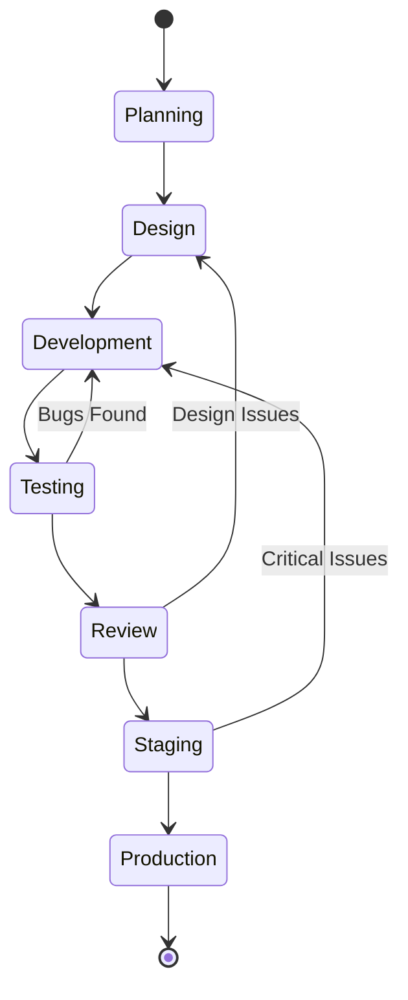
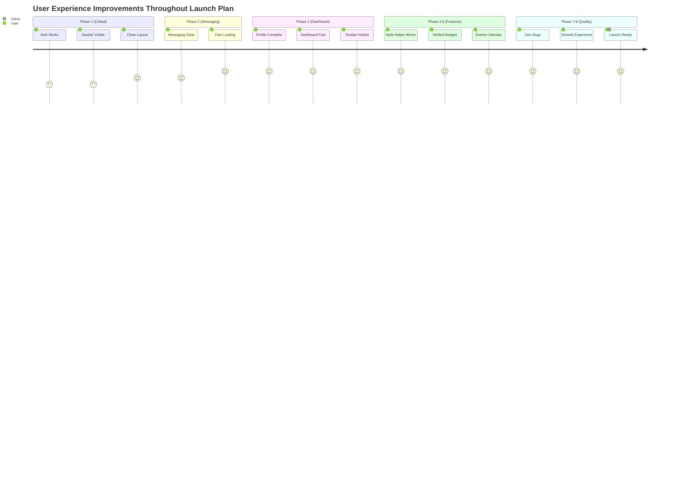
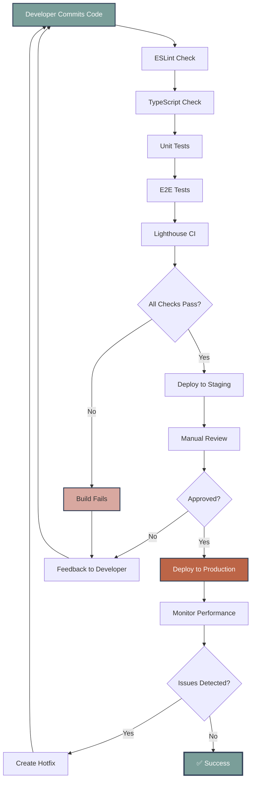
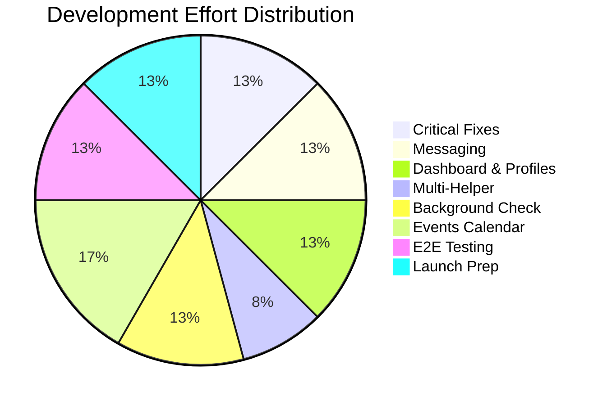
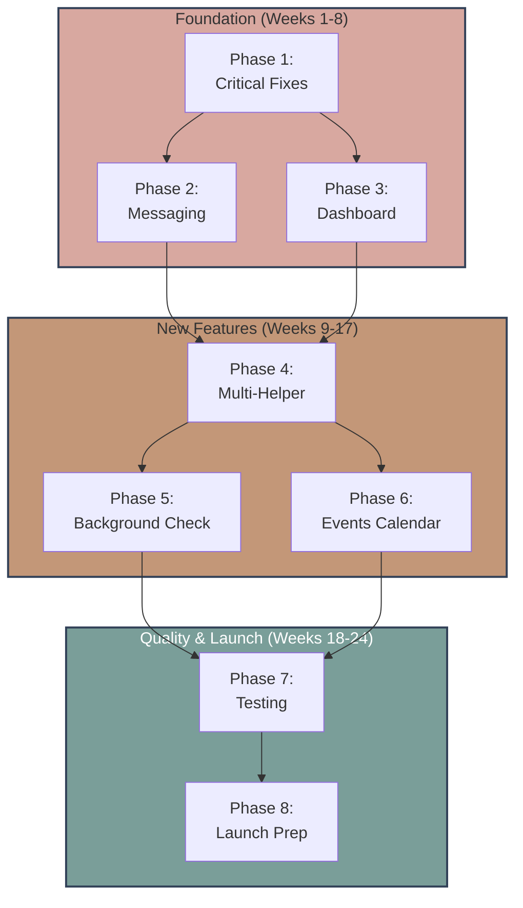
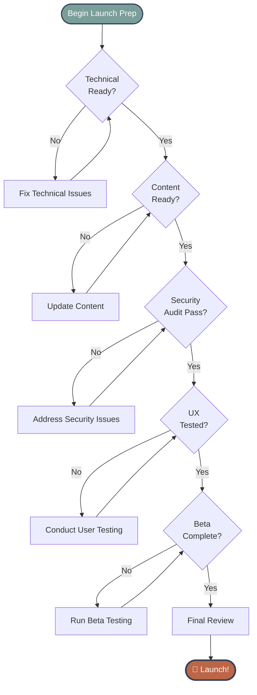
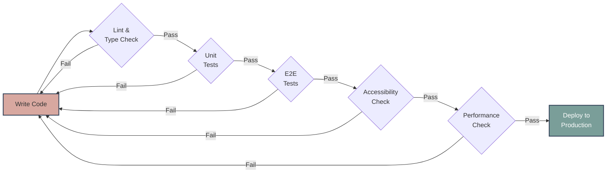

# Launch Timeline - Visual Diagrams

This document contains visual representations of the Care Collective launch timeline using Mermaid diagrams.

---

## 🔄 Phase Dependencies Flow



---

## 🎯 Priority-Based Roadmap

```mermaid
flowchart LR
    subgraph Critical["🚨 Critical Priority"]
        A1[Auth Button Fix]
        A2[Navbar Visibility]
        A3[Footer Redesign]
        A4[Messaging UX]
        A5[Performance Fixes]
    end

    subgraph High["⚡ High Priority"]
        B1[Dashboard Speed]
        B2[Profile Pictures]
        B3[Caregiving Field]
        B4[Multi-Helper System]
    end

    subgraph Medium["📋 Medium Priority"]
        C1[Background Check Badge]
        C2[Events Calendar]
        C3[RSVP System]
    end

    subgraph Essential["✅ Essential Quality"]
        D1[E2E Testing]
        D2[Accessibility Tests]
        D3[Security Audit]
        D4[Beta Testing]
    end

    Critical --> High
    High --> Medium
    Medium --> Essential
    Essential --> Launch([🚀 Launch])

    style Critical fill:#BC6547,stroke:#324158,stroke-width:2px,color:#fff
    style High fill:#D8A8A0,stroke:#324158,stroke-width:2px
    style Medium fill:#C39778,stroke:#324158,stroke-width:2px
    style Essential fill:#7A9E99,stroke:#324158,stroke-width:2px,color:#fff
    style Launch fill:#324158,stroke:#BC6547,stroke-width:3px,color:#fff
```



---

## 🏗️ Feature Development Flow



---

## 🎯 User Journey Improvements



---

## 🔄 Continuous Integration Pipeline



---

## 📈 Progress Tracking



---

## 🎯 Impact vs Effort Analysis

```mermaid
quadrantChart
    title Feature Priority Matrix
    x-axis Low Effort --> High Effort
    y-axis Low Impact --> High Impact
    quadrant-1 Plan for Later
    quadrant-2 Do First (Critical)
    quadrant-3 Quick Wins
    quadrant-4 Major Projects
    Auth Fix: [0.2, 0.9]
    Navbar Visibility: [0.1, 0.7]
    Messaging UX: [0.5, 0.9]
    Performance: [0.6, 0.85]
    Multi-Helper: [0.4, 0.6]
    Background Check: [0.7, 0.7]
    Events Calendar: [0.8, 0.5]
    E2E Testing: [0.7, 0.9]
    Profile Pictures: [0.3, 0.5]
    Dashboard Speed: [0.5, 0.8]
```

---

## 📊 Phase Relationships



---

## 🚀 Launch Readiness Checklist Flow



---

## 📋 Weekly Sprint Structure

```mermaid
gantt
    title Weekly Sprint Pattern
    dateFormat X
    axisFormat Week %W
    section Planning
    Sprint Planning           :a1, 0, 1
    section Development
    Feature Development       :a2, 1, 4
    section Testing
    Testing & QA              :a3, 4, 2
    section Review
    Code Review               :a4, 5, 1
    Deploy to Staging         :a5, 6, 1
    section Retrospective
    Sprint Review             :a6, 6, 1
```



---

## 🎯 Quality Gates



---

*These diagrams provide a visual overview of the launch plan structure. For detailed implementation information, refer to individual phase documents in `./phases/`.*
